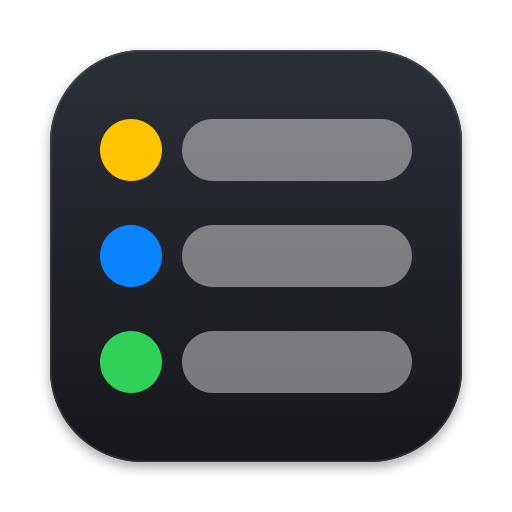

# agentstatus 

An open status protocol for coding agents, plus a small CLI that writes and reads it: see at a glance which of your Claude Code (or any other agent) sessions is working, which one needs you, and which one is idle.

The panel is macOS-only. The protocol and CLI also build on Linux.

## Install

macOS 14 or later, Apple Silicon and Intel.

```sh
brew tap timohone/agentstatus https://github.com/Timohone/agentstatus
brew install --cask timohone/agentstatus/agentstatus
agentstatus setup
```

Without Homebrew: download the ZIP from [GitHub Releases](https://github.com/Timohone/agentstatus/releases), move `AgentStatus.app` to `/Applications`, then:

```sh
/Applications/AgentStatus.app/Contents/Helpers/agentstatus setup
```

`setup` shows each change to your agents' configuration, asks first, and offers a link at `~/.local/bin/agentstatus` if the command is not on your PATH.

## Supported agents

| Agent | Status |
|---|---|
| Claude Code | verified |
| Codex | hooks appear; the needs-you mapping comes from the docs, confirm the hook once in `/hooks` |
| Grok | experimental |

## Use

One command connects everything it finds (Claude Code, Codex, Grok), showing each diff and asking first:

```sh
agentstatus setup               # --yes answers all questions, --only claude,codex limits it
agentstatus setup --remove      # takes everything setup added back out
```

Or per agent. Claude Code, via hooks (shows the diff, backs up your settings, asks first):

```sh
agentstatus install claude
agentstatus uninstall claude   # removes exactly what install added
```

After updating agentstatus, run `agentstatus install claude` again: newer versions register more hooks.

`install` rewrites `settings.json` with sorted keys, so the first run shows a one-time diff beyond the added hooks.

Codex works the same way (`agentstatus install codex`, needs Codex installed). Codex asks you to trust the new hook: open a Codex session and confirm it once in `/hooks`.

Grok needs no install of its own: it reads Claude's hooks, so `agentstatus install claude` covers it (sessions show up as `grok`). Experimental: `agentstatus install grok` writes a dedicated `~/.grok/hooks/agentstatus.json` (`uninstall grok` removes it); native hooks are not yet verified on a real run. Using both routes is harmless but redundant (same state is written twice).

Any other CLI:

```sh
agentstatus run -- <cli> [args...]
```

Inspect sessions:

```sh
agentstatus list [--json]
```

## Uninstall

Remove the hooks first, otherwise your agents keep calling a missing command, and this also switches off Launch at Login:

```sh
agentstatus setup --remove     # all agents at once, or per agent:
agentstatus uninstall claude
agentstatus uninstall codex
brew uninstall --cask agentstatus    # add --zap to also delete settings and ~/.agentstatus
brew untap timohone/agentstatus
```

If `setup` created a settings or hooks file, it stays behind as an empty `{}` after `--remove` (harmless). Grok's own `agentstatus.json` is deleted.

## Panel

The panel reads `$AGENTSTATUS_DIR` only if it is in its environment. A panel started from Finder or as a login item does not inherit variables from your shell, so it always watches `~/.agentstatus/sessions/`.

Right-click a row to rename its project (the field starts with the current name; the name is kept per project root). The context menu also holds:

- **Launch at Login**: needs `AgentStatus.app` in `/Applications` (or `~/Applications`).
- **Notify When a Session Needs You**: a notification and a sound when a session turns to "needs you". On by default; the first start asks for permission.

## Debugging adapters

`agentstatus debug on` creates `~/.agentstatus/hook-log.jsonl`; while it exists, every `agentstatus hook` call appends one line (time, agent, detected agent, recorded pid, raw payload), up to 5 MB. `agentstatus debug status` shows size and line count.

**The file contains your prompts and tool inputs.** Run `agentstatus debug off` (deletes it) when you are done.

## Protocol

One JSON file per session in `~/.agentstatus/sessions/` (or `$AGENTSTATUS_DIR`). Any agent can be integrated with one line of shell. See [PROTOCOL.md](PROTOCOL.md) and [schema/session.v1.json](schema/session.v1.json).

## Privacy

No network, no telemetry. Everything stays on your machine.

## Build from source

Needs Go and, for the panel, Swift on macOS:

```sh
go install github.com/Timohone/agentstatus/cmd/agentstatus@latest   # CLI only
scripts/build-app.sh                                                # AgentStatus.app, ad-hoc signed
```

## License

MIT, see [LICENSE](LICENSE).
